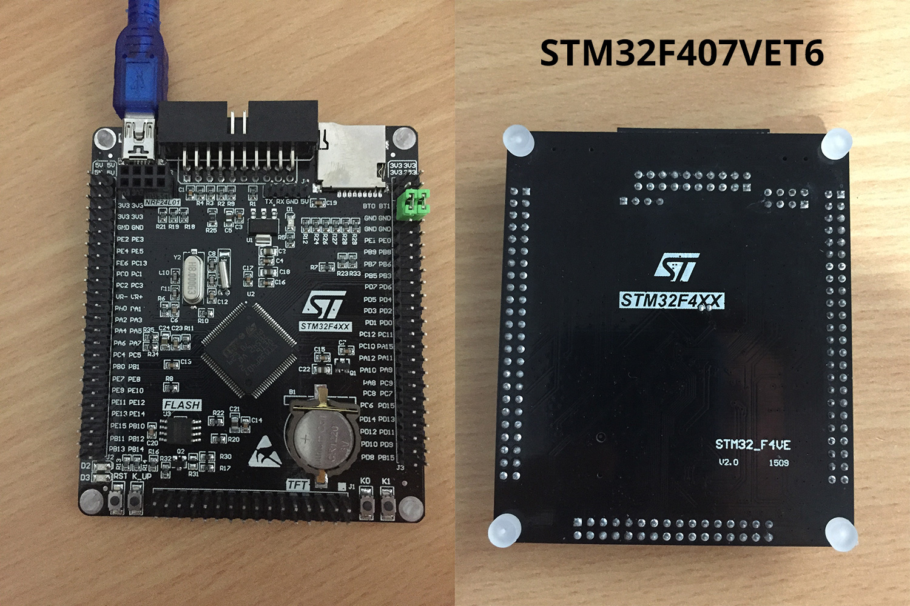

# Black STM32F407VET6

MicroPython board definition files for the unbranded black STM32F407VET6 dev board.

**Brand:** Unbranded/Generic

**Markings:** STM32F4XX STM32_F4VE V2.0 1509



You can buy one for around $12 USD on [AliExpress](https://www.aliexpress.com/item/Free-shipping-STM32F407VET6-development-board-Cortex-M4-STM32-minimum-system-learning-board-ARM-core-board/32618222721.html)

### Build and deploy the firmware:

* Clone the board definitions to your [MicroPython](https://github.com/micropython/micropython) stmhal/boards folder.

```
cd micropython/stmhal/boards
git clone https://github.com/mcauser/BLACK_F407VE.git
```

* Disconnect the board from USB
* Set BOOT0 jumper to ON (BT0->3V3)
* Connect the board via USB

```
cd micropython/stmhal
make BOARD=BLACK_F407VE
make BOARD=BLACK_F407VE deploy
```

* Disconnect the board from USB
* Set BOOT0 jumper to OFF (BT0->GND)
* Connect the board via USB

```
$ screen /dev/tty.usbmodem1422
```

### Specifications:

* STM32F407VET6 ARM Cortex M4
* 168MHz, 210 DMIPS / 1.25 DMIPS / MHz
* 1.8V - 3.6V operating voltage
* 8MHz system crystal
* 32.768KHz RTC crystal
* 2.54mm pitch pins
* JTAG/SWD header
* 512KByte Flash, 192 + 4 KByte SRAM
* 3x SPI, 3x USART, 2x UART, 2x I2S, 3x I2C
* 1x FSMC, 1x SDIO, 2x CAN
* 1x USB 2.0 FS / HS controller (with dedicated DMA)
* 1x USB HS ULPI (for external USB HS PHY)
* Micro SD
* Winbond W25Q16 16Mbit SPI Flash
* RTC battery CR1220
* 1x 10/100 Ethernet MAC
* 1x 8 to 12-bit Parallel Camera interface
* 3x ADC (12-bit / 16-channel)
* 2x DAC (12-bit)
* 12x general timers, 2x advanced timers
* AMS1117-3.3V: 3.3V LDO voltage regulator, max current 800mA
* Micro USB for power and comms
* Red power LED D1
* Red user LED D2 (PA6)
* Red user LED D3 (PA7)
* 2x jumpers for bootloader selection
* Reset button, Wakeup button, 2x user buttons K0 (PE4) and K1 (PE3)
* 2x24 side pins + 2x16 bottom pins + 1x4 ISP pins
* 2x16 FMSC LCD Interface
* NRF24L01 socket
* M3 mounting holes
* Dimensions: 85.1mm x 72.45mm

### Modifications:

* change HSE_VALUE from 8000000 to 25000000
* change PLL_M from 8 to 25
